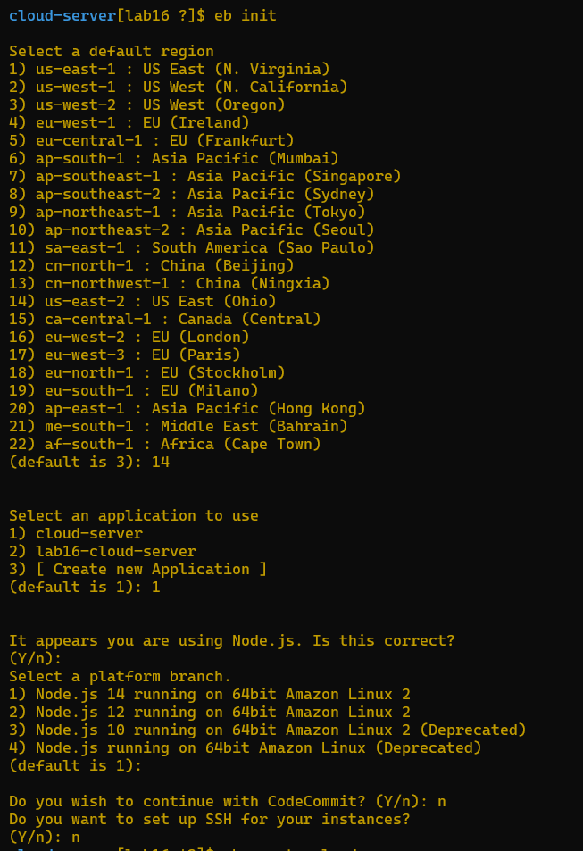
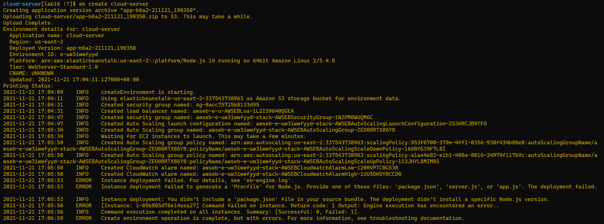
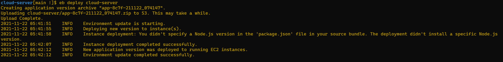
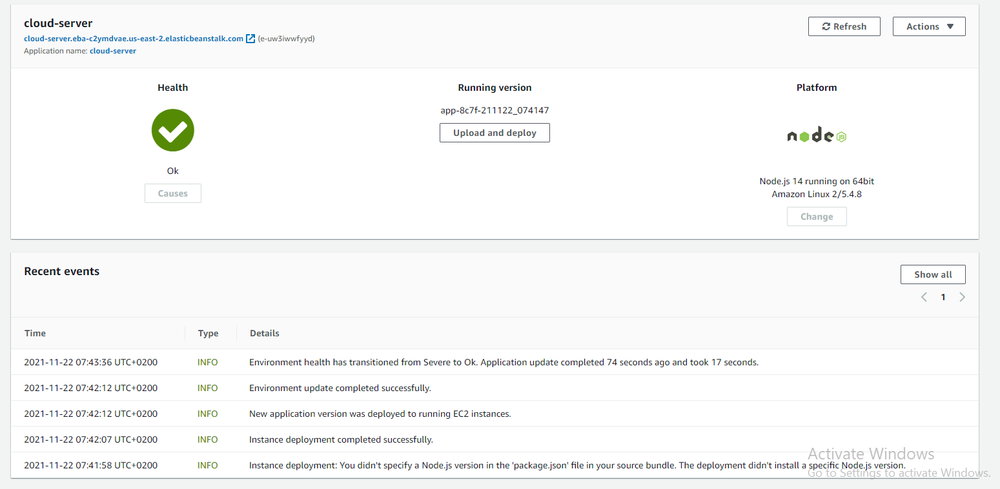

# cloud-server

### Author : Nashat Alzaatreh

## Deploy, Run and Test

- [Pull Request](https://github.com/NashatAlzaatreh/cloud-server/pull/1)
- [deployed link](http://cloud-server.eba-c2ymdvae.us-east-2.elasticbeanstalk.com/)

## Steps

- `eb init` -> select region -> create an application or select one -> use node.js -> `eb create cloud-server`
  
  
  
  
